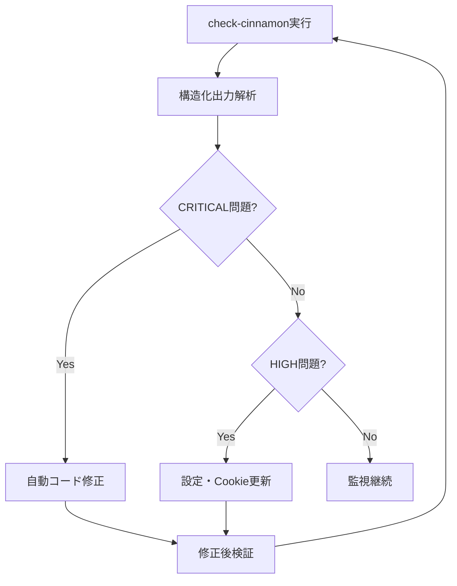

# Cinnamonサーバー運用ガイド

## 概要
Cinnamonサーバーは複数のTwitterアカウントで自動ブロック処理を並列実行するための専用サーバーです。このドキュメントは本番環境での運用に特化した情報を提供します。

## 基本情報
- **アクセス方法**: `ssh Cinnamon`
- **プロジェクトパス**: `/mnt/hdd/cinnamon/twitter-auto-blocking/bulk-block-users`
- **Docker Compose設定**: `compose.yaml`

## 稼働中のサービス
- `book000`: promoted_and_blueverified.json対象
- `book000_vrc`: promoted_only.json対象  
- `ihc_amot`: promoted_only.json対象
- `tomachi_priv`: promoted_and_blueverified.json対象
- `authorizedkey`: promoted_and_blueverified.json対象
- `tomarabbit`: promoted_and_blueverified.json対象

## Claude Codeコマンド

### `/project:check-cinnamon` - AI最適化版
**概要**: Claude Code専用の包括的サーバー監視・問題特定・修正提案システム

**実行方法**: 
```bash
.claude/cinnamon-logs-ai-optimized.sh
```

**特徴**:
- 構造化された問題特定
- 具体的なコード修正提案
- 重要度別の問題分類
- 自動修正可能な項目の識別

**出力形式**:
```
SECTION_START: セクション名
FINDING: severity=CRITICAL category=CODE message="問題説明"
  DETAILS: 詳細情報
  RECOMMENDED_ACTION: 推奨対応
SECTION_END: セクション名
```

### `/project:restart-service [service_name]`
指定サービスまたは全サービスの再起動

## AI最適化監視システム

### 利用可能なスクリプト

#### 1. メイン監視スクリプト (推奨)
```bash
.claude/cinnamon-logs-ai-optimized.sh
```
**目的**: Claude Codeによる自動問題特定・修正
**出力**: 構造化された分析結果、具体的修正提案

#### 2. 統合監視インターフェース
```bash
.claude/cinnamon-monitor-suite.sh [mode]
```
**利用可能モード**:
- `basic`: 基本ログ調査
- `advanced`: 高度分析
- `trend`: エラートレンド分析  
- `quick`: 5分間クイック診断
- `emergency`: 緊急診断モード
- `ai`: AI最適化分析 (推奨)

### 問題検出パターン

#### KeyError: 'error_message' (CRITICAL)
**検出方法**: `CODE_ANALYSIS_RECOMMENDATIONS`セクション
```
ISSUE: KeyError_in_manager_py
  SEVERITY: CRITICAL
  FILE: twitter_blocker/manager.py
  LINES: 402-403, 493
  CODE_FIX: 'failure_info.get("key", default) if failure_info else default'
```
**自動修正**: manager.pyの安全な辞書アクセスパターンに変更

#### 認証エラー多発 (HIGH)
**検出方法**: `AUTHENTICATION_STATUS`セクション
```
ISSUE: Authentication_failure_service_name
  SEVERITY: HIGH
  SERVICE: service_name
  SOLUTION: Update cookies.json for service_name
```
**対応**: 該当サービスのCookie更新

#### パフォーマンス劣化 (MEDIUM)
**検出方法**: `PERFORMANCE_ANALYSIS`セクション
```
ISSUE: Service_performance_degradation_service_name
  ERRORS: エラー数
  SUCCESSFUL_BLOCKS: 成功数
```
**対応**: サービス設定見直し・再起動

### Claude Code期待動作

#### 正常時の出力
```
OVERALL_STATUS: HEALTHY
TOTAL_FINDINGS: 0
ACTIONABLE_ITEMS: MAINTENANCE_ONLY
```

#### 問題検出時の出力
```
OVERALL_STATUS: CRITICAL
TOTAL_FINDINGS: 3
ACTIONABLE_ITEMS: YES

IMMEDIATE_FIXES_REQUIRED:
  1. Fix KeyError in manager.py failure_info handling
```

### 自動修正ワークフロー



## 運用監視

### 日常チェック項目
1. **コンテナ状態確認**
   ```bash
   ssh Cinnamon "cd /mnt/hdd/cinnamon/twitter-auto-blocking/bulk-block-users && docker compose ps"
   ```

2. **エラー統計確認**
   ```bash
   ssh Cinnamon "cd /mnt/hdd/cinnamon/twitter-auto-blocking/bulk-block-users && docker compose logs --tail 1000 | grep -E '(エラー|error|failed|401|403|429|500)' | sort | uniq -c | sort -nr | head -10"
   ```

3. **各サービスの処理状況**
   ```bash
   for service in book000 book000_vrc ihc_amot tomachi_priv authorizedkey tomarabbit; do
       echo "=== $service ==="
       ssh Cinnamon "cd /mnt/hdd/cinnamon/twitter-auto-blocking/bulk-block-users && docker compose logs $service --tail 50 | grep -E '(ブロック成功|スキップ|エラー)' | tail -5"
   done
   ```

### 問題の兆候
- **🔴 緊急**: 全コンテナ停止、継続的な401認証エラー
- **🟡 要注意**: 403エラーの急増、特定サービスの異常停止
- **🟢 正常**: 404エラー（削除済みアカウント）、一時的なレートリミット

## エラー対処

### 認証エラー（401）対応
1. **Cookie確認**
   ```bash
   # 該当アカウントのCookieファイル確認
   ssh Cinnamon "ls -la /mnt/hdd/cinnamon/twitter-chrome/userdata/{account_name}/cookies.json"
   ```

2. **Cookie更新手順**
   - 対象アカウントでChromeに再ログイン
   - Cookie抽出ツールでcookies.jsonを更新
   - 該当Dockerサービスを再起動

### 403エラー分析
```bash
# 403エラーの詳細調査
ssh Cinnamon "cd /mnt/hdd/cinnamon/twitter-auto-blocking/bulk-block-users && docker compose logs --tail 200 | grep -A10 -B5 'Status Code: 403'"

# 影響サービスの特定
ssh Cinnamon "cd /mnt/hdd/cinnamon/twitter-auto-blocking/bulk-block-users && docker compose logs --tail 500 | grep -E '403.*authorizedkey|403.*book000|403.*tomachi'"
```

### レートリミット確認
```bash
ssh Cinnamon "cd /mnt/hdd/cinnamon/twitter-auto-blocking/bulk-block-users && docker compose logs --tail 200 | grep -E 'Rate Limit:' | tail -10"
```

## 緊急時対応

### 全体停止
```bash
ssh Cinnamon "cd /mnt/hdd/cinnamon/twitter-auto-blocking/bulk-block-users && docker compose down"
```

### 全体再起動
```bash
ssh Cinnamon "cd /mnt/hdd/cinnamon/twitter-auto-blocking/bulk-block-users && docker compose up -d"
```

### 個別サービス再起動
```bash
ssh Cinnamon "cd /mnt/hdd/cinnamon/twitter-auto-blocking/bulk-block-users && docker compose restart {service_name}"
```

## エスカレーション基準

### 即座にエスカレーション
- 全サービス停止（30分以上）
- 継続的な認証エラー（1時間以上）
- セキュリティ関連の異常

### 監視継続
- 一時的な403エラー
- 個別サービスの一時停止
- レートリミットによる待機

## 定期メンテナンス

### 週次作業
- ログファイルのローテーション確認
- ディスク容量チェック
- パフォーマンス統計の確認

### 月次作業
- Cookie有効期限の確認
- Docker imageの更新確認
- 処理統計の分析